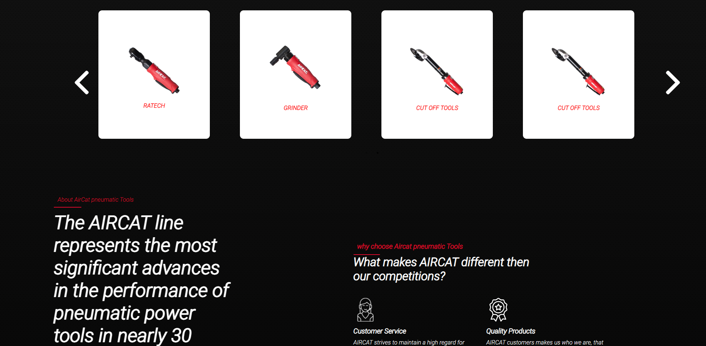

# Hello Vister my Name is shivam pandey and I am a full Stack developer with Great proficiency in Frontend development

### This Project is done under the React.js Fresher position on Beta Soft Tech

> Here is the Website Given Model

> And Here are the model I have Created
>     

[Live Link](https://beta-softtech.vercel.app/)

<a href="https://www.linkedin.com/in/shivam-pandey-858772207/">
 
 My LinkeDin
</a>
 
<a href="https://github.com/Shivampandey9540">
 
Github
</a>
